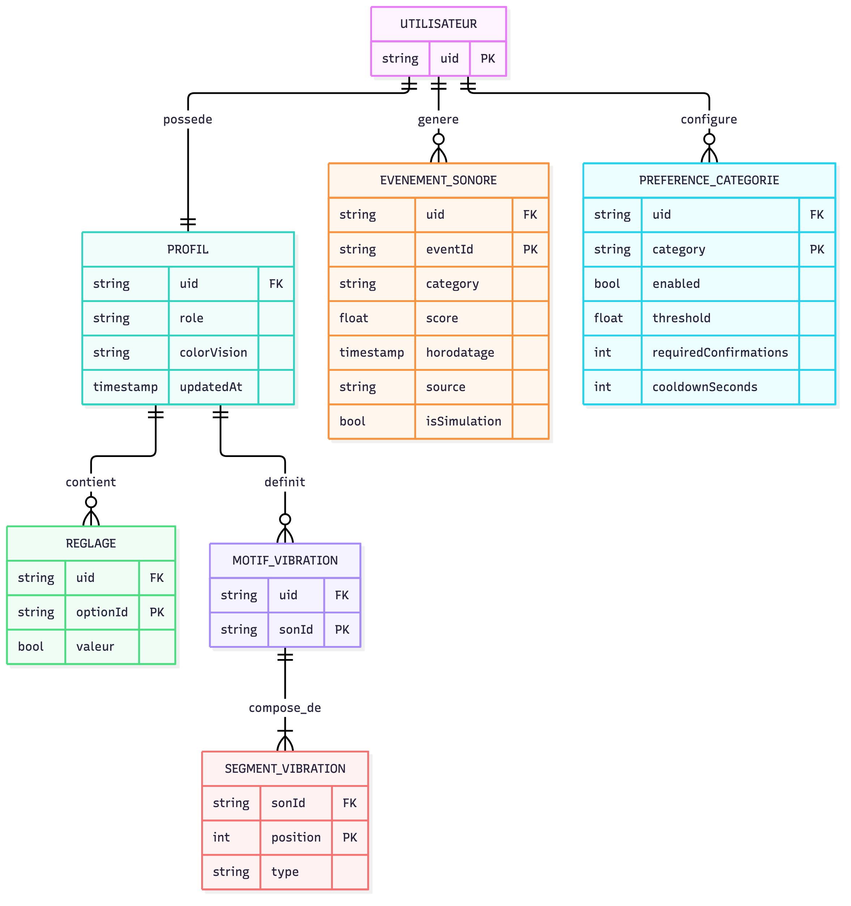
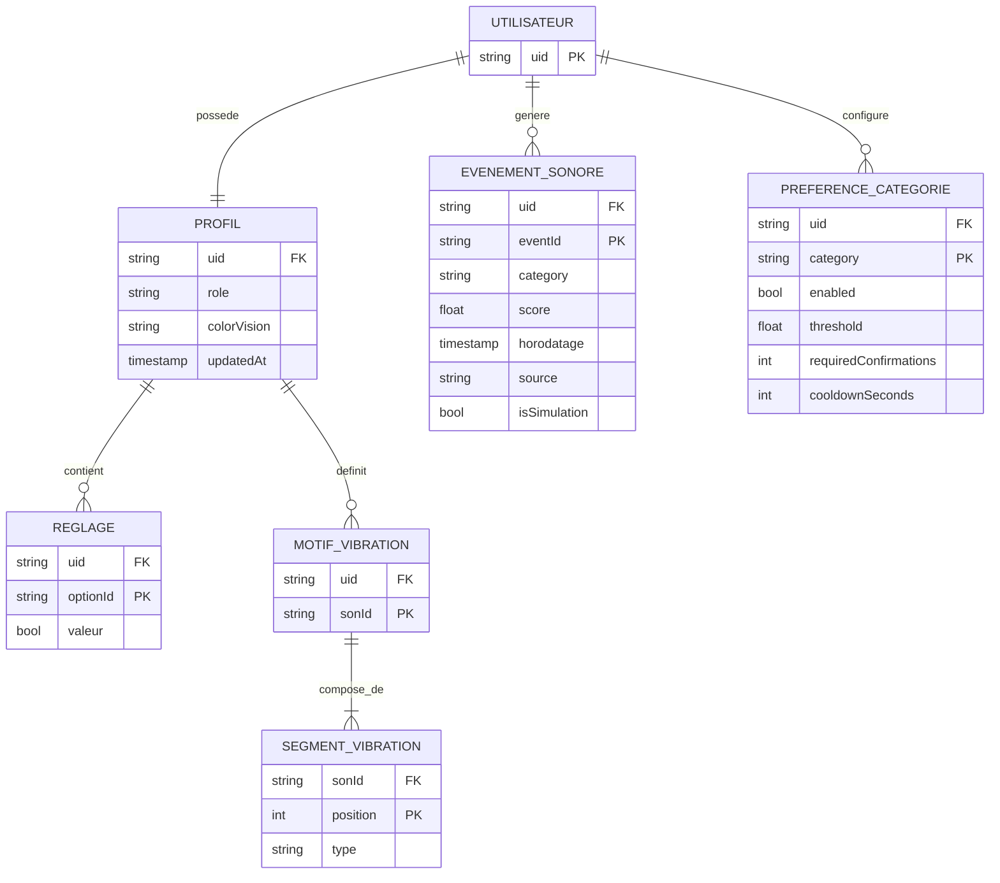

# MCD — Stockage des données utilisateur (SENSIA)

Modèle conceptuel de données des informations liées à un utilisateur de
l'app, tel qu'implémenté aujourd'hui dans `app/lib` (Firebase Auth anonyme +
Cloud Firestore). Chaque entité correspond à une collection/document réel,
listé dans le dictionnaire de données en bas de page.

## Diagramme entité-association

## Entités et cardinalités

- **UTILISATEUR (1,1) — PROFIL (1,1)** : un utilisateur (connexion Firebase
  anonyme, pas de compte email/mot de passe) possède exactement un profil.
- **UTILISATEUR (1,1) — EVENEMENT_SONORE (0,N)** : un utilisateur génère
  zéro, un ou plusieurs événements sonores détectés (historique).
- **UTILISATEUR (1,1) — PREFERENCE_CATEGORIE (0,N)** : un utilisateur
  configure les réglages de déclenchement pour chaque catégorie de son
  (ex. "sonnette", "aboiement").
- **PROFIL (1,1) — REGLAGE (0,N)** : le profil référence les réglages de
  l'écran Réglages, sous forme clé (`optionId`) → valeur booléenne.
- **PROFIL (1,1) — MOTIF_VIBRATION (0,N)** : le profil référence les motifs
  de vibration personnalisés, un par son configuré.
- **MOTIF_VIBRATION (1,1) — SEGMENT_VIBRATION (1,N)** : un motif est une
  séquence ordonnée d'au moins un segment (`long` ou `short`).

## Notes de modélisation

- **Authentification anonyme uniquement** : pas d'email, mot de passe ni
  nom associés à `UTILISATEUR` — seul `uid` (généré par Firebase Auth)
  identifie la personne. Rien d'autre à ce niveau n'est collecté.
- `ROLE` (`accompagnateur` | `client`) et `colorVision` (`protanopie`,
  `deutéranopie`, `tritanopie`, `achromatopsie`, `daltonisme`) sont des
  domaines de valeurs fixes (énumérations), pas des entités séparées : ils
  sont modélisés comme attributs de `PROFIL`.
- `REGLAGE` et `MOTIF_VIBRATION` sont conceptuellement des collections
  clé/valeur imbriquées dans le document `PROFIL`, pas des sous-collections
  Firestore distinctes — voir le mapping physique ci-dessous.
- `PREFERENCE_CATEGORIE` est stockée comme un unique document
  (`settings/vibrations`) contenant une carte `category → réglages`, plutôt
  qu'un document par catégorie ; le MCD la modélise malgré tout comme une
  entité à part car elle a sa propre clé (`category`) et son propre cycle de
  vie applicatif (réglages avancés, indépendants du profil).

## Mapping physique (Cloud Firestore)

| Entité conceptuelle | Chemin Firestore réel | Type de document |
|---|---|---|
| UTILISATEUR | `users/{uid}` | document racine (implicite, jamais lu/écrit directement) |
| PROFIL + REGLAGE + MOTIF_VIBRATION + SEGMENT_VIBRATION | `users/{uid}/profile/main` | 1 document (champs `role`, `colorVision`, map `settings`, map `vibrationPatterns`) |
| EVENEMENT_SONORE | `users/{uid}/events/{eventId}` | 1 document par événement |
| PREFERENCE_CATEGORIE | `users/{uid}/settings/vibrations` | 1 document (map `category → réglages`) |

L'isolation entre utilisateurs est appliquée côté serveur par
`firestore.rules` (chaque utilisateur ne peut lire/écrire que sous
`users/{son propre uid}`), pas seulement par le code client.

## Dictionnaire de données

| Attribut | Entité | Type | Description | Source |
|---|---|---|---|---|
| uid | UTILISATEUR | string | Identifiant Firebase Auth (connexion anonyme) | `history/current_user.dart` |
| role | PROFIL | enum (`accompagnateur`, `client`) | Rôle choisi à l'onboarding | `models/user_role.dart` |
| colorVision | PROFIL | enum | Type de déficience de vision des couleurs déclaré | `models/color_vision_type.dart` |
| updatedAt | PROFIL | timestamp serveur | Horodatage de la dernière sauvegarde | `profile/firestore_profile_repository.dart` |
| optionId / valeur | REGLAGE | string / bool | Réglage de l'écran Réglages, par identifiant d'option | `models/user_profile.dart` (`settings`) |
| sonId | MOTIF_VIBRATION | string | Identifiant du son associé au motif construit | `models/user_profile.dart` (`vibrationPatterns`) |
| position / type | SEGMENT_VIBRATION | int / enum (`long`, `short`) | Segment ordonné composant un motif de vibration | `models/vibration_segment.dart` |
| eventId | EVENEMENT_SONORE | string | Id généré côté client (`.doc().id`), évite les doublons en cas de retry | `history/firestore_history_repository.dart` |
| category | EVENEMENT_SONORE / PREFERENCE_CATEGORIE | string | Catégorie sonore reconnue (ex. `sonnette`, `aboiement`) | `sound_events/sound_event.dart` |
| score | EVENEMENT_SONORE | float | Score du modèle IA, non calibré comme une probabilité | `sound_events/sound_event.dart` |
| horodatage | EVENEMENT_SONORE | timestamp | Date/heure de la détection | `sound_events/sound_event.dart` |
| source | EVENEMENT_SONORE | string | Origine (`microphone`, `simulation`) | `sound_events/sound_event.dart` |
| isSimulation | EVENEMENT_SONORE | bool | Événement injecté par le mode simulation ou réel | `sound_events/sound_event.dart` |
| enabled | PREFERENCE_CATEGORIE | bool | Catégorie active ou non pour le déclenchement | `sound_events/category_settings.dart` |
| threshold | PREFERENCE_CATEGORIE | float | Score minimal qualifiant | `sound_events/category_settings.dart` |
| requiredConfirmations | PREFERENCE_CATEGORIE | int | Détections consécutives requises avant déclenchement | `sound_events/category_settings.dart` |
| cooldownSeconds | PREFERENCE_CATEGORIE | int | Délai minimal entre deux déclenchements de la catégorie | `sound_events/category_settings.dart` |

## Hors périmètre actuel

- `models/association.dart` / `config/associations.dart` : données
  d'associations affichées à l'écran Associations, actuellement en dur
  (`Associations.placeholder`), pas encore rattachées à un utilisateur ni
  persistées — à modéliser si une vraie source de données est branchée.
